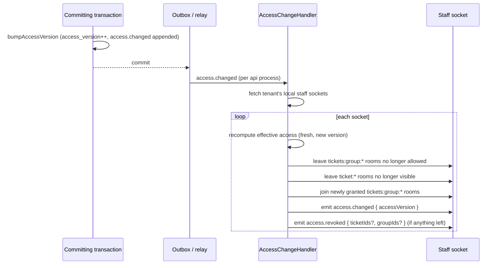

Staff access is decided in exactly one place, the policy service. Every other
piece — the permission registry, the route decorators, the route audit — exists
to keep that true. This page documents the pieces and how a module adds itself
to them.

## The registry

A module declares its permissions once, as a `ModulePermissions` value built
with `definePermissions()`
(`apps/api/src/authorization/registry/module-permissions.ts`), and registers it
as a provider with `permissionsProvider()`. `PermissionRegistry`
(`apps/api/src/authorization/registry/registry.service.ts`) collects every
declaration through Nest's `DiscoveryService` at start-up
(`onModuleInit`) and throws if two modules declare the same `resource.action`
key.

On the `api` process's boot (`onApplicationBootstrap`, gated by
`RegistryOptions.syncOnBootstrap`), `PermissionRegistry.sync()`:

1. Upserts every declared key into `permission_definitions` (under an advisory
   lock, so several `api` instances starting together don't race). Keys that
   exist in the database but no longer appear in code are left alone and only
   logged — grants referencing them stay valid.
2. Grants every key to each tenant's Admin role
   (`grantRegistryToAdminRole`), paging tenants and skipping already-granted
   rows (`ON CONFLICT DO NOTHING`). This is the *only* place Admin's access
   comes from; there is no hard-coded bypass. If any grant was new, it bumps
   that tenant's access version so already-cached Admins pick it up.

The initial set of declarations for every module built so far lives in
`apps/api/src/authorization/registry/initial-permissions.ts`. Once a module
owns its own permissions it registers them from its own module file instead of
this list.

### Adding a module's permissions

1. In the module's own file, declare its resources and actions with
   `definePermissions()`:

   ```ts
   // apps/api/src/webhooks/webhooks.module.ts
   import { definePermissions, permissionsProvider } from '../authorization/registry/module-permissions.js';

   const WebhookPermissions = definePermissions({
     module: 'integrations',
     resources: [
       {
         resource: 'webhook',
         actions: [
           { action: 'view', description: 'View webhooks' },
           { action: 'create', description: 'Create a webhook' },
           { action: 'edit', description: 'Edit a webhook' },
           { action: 'delete', description: 'Delete a webhook' },
         ],
       },
     ],
   });
   ```

   Module, resource and action names must match `^[a-z][a-z_]*$`
   (`NAME_PATTERN`); `definePermissions()` throws at start-up otherwise. A
   permission key is `resource.action` (e.g. `webhook.create`), so it must be
   unique across every module.

2. Register it as a provider in the module:

   ```ts
   @Module({
     providers: [WebhooksService, permissionsProvider(WebhookPermissions)],
   })
   export class WebhooksModule {}
   ```

3. Guard every route that touches the resource with
   `@RequirePermission('webhook.create')` (see below). The route audit fails
   start-up if the key isn't in the registry, so a typo is caught immediately
   rather than at request time.

4. On the next `api` start-up, `PermissionRegistry.sync()` upserts the new
   keys and grants them to every tenant's Admin role automatically — nothing
   else to run. Non-Admin roles never get the new permission until an admin
   edits a role to add it (`RolesService.update`).

## Route decorators and the route audit

Every controller route must carry exactly one access decorator
(`apps/api/src/authorization/registry/module-permissions.ts`), either on the
handler or, if the handler has none, on the controller:

- `@RequirePermission(key)` — staff only; the permission guard asks the policy
  service to decide `key`. This is the default for any route that touches
  tenant data.
- `@Public()` — no session needed (sign-in, branding, health checks).
- `@StaffApi()` — any signed-in staff user, no permission key. Confined to the
  caller's own account (`/auth`, `/me`) — never for tenant data.
- `@CustomerApi()` — customer session, authorized by ownership of the caller's
  own conversation, under `customer/*`.
- `@OperatorApi()` — console host with an operator session, under `platform/*`.

`RouteAudit` (`apps/api/src/authorization/registry/route-audit.ts`) runs on
`onApplicationBootstrap` and throws (stopping the `api` process from starting)
if any route:

- has zero or more than one access decorator;
- uses `@RequirePermission` with a key the registry doesn't know;
- uses `@StaffApi()` outside `/auth` or `/me`;
- uses `@CustomerApi()` outside `/customer/*`, or a non-customer decorator
  inside it (other than `@Public()`);
- uses `@OperatorApi()` outside `/platform/*`, or a non-operator decorator
  inside it (other than `@Public()`).

`PermissionGuard` (`apps/api/src/authorization/permission.guard.ts`), the last
guard in the pipeline, enforces the decorator at request time:

- `@Public()` — passes.
- `@OperatorApi()` — needs the console host and an operator session, else 404.
- `@StaffApi()` — needs a staff actor, else 404.
- `@CustomerApi()` — needs a customer actor, else 404.
- `@RequirePermission(key)` — a support session (an operator under a support
  grant) passes every permission route, since the grant is its authorization
  and the support guard has already confined it to reads. Otherwise it needs a
  staff actor (else 404) and asks `PolicyService.can()`: `allow` passes,
  `not_found` → 404, `deny` → 403.

A customer hitting a staff route, or staff hitting a customer route, always
gets 404, not 403 — the other surface doesn't exist for them.

## The policy service

`PolicyService` (`apps/api/src/authorization/policy.service.ts`) is the only
place that decides staff access. Effective access for a user is the union,
over every role they hold, of:

- the role's `role_permissions` rows (a flat set of permission keys), and
- the role's `role_group_access` rows: per group id (and the built-in
  Ungrouped entry, `group_id = null`), `view`/`create`/`edit`/`delete` flags.

Only active staff users (`users.status = 'active'`, `users.kind = 'staff'`)
have any access; anyone else gets `emptyAccess()`.

`decide(access, key, resource?)` is the pure decision function:

- For a non-ticket key, `access.permissions.has(key)`.
- For a ticket resource (`{ type: 'ticket', groupId }`), the action needs
  *both* the registry key and the matching group flag
  (`TICKET_ACTION_FLAGS`: `ticket.view|create|edit|delete` map to the
  same-named flag; `ticket.merge|split|bulk_update|move_message` need `edit`).
  If the caller can't view the ticket's group (`ticket.view` missing, or no
  `view` flag on that group), the result is `not_found`, never `deny` — a
  ticket outside the caller's groups doesn't exist for them.

`PolicyService.can(ctx, key, resource?)` decides for the context's user actor
(`ctx.actor.kind === 'user'`; anything else throws — the policy service never
decides for system or support actors).

### The ticket access filter

`ticketAccessFilter(ctx, action, column = 'tickets.group_id')` returns a Kysely
expression that scopes a list query to the groups (and Ungrouped) where the
caller can perform `action`. It's built from the same `grantedGroups()` used
by `decide()`, so a list and a single read always agree:

```ts
const filter = await policy.ticketAccessFilter(ctx, 'view');
const tickets = await tx
  .selectFrom('tickets')
  .selectAll()
  .where(filter)
  .execute();
```

`grantedGroups(access, action)` returns `{ groupIds, ungrouped }`: empty
(nothing granted) if the caller lacks the matching registry key
(`ticket.view` for `view`, etc.), otherwise every group id with that flag set,
plus `ungrouped: true` if the Ungrouped entry has it. `groupFilter()` turns
that into `column = ANY(groupIds) OR (ungrouped AND column IS NULL)`, or
`false` when nothing is granted.

## Group access and Ungrouped

A group's access lives in `role_group_access`, one row per
`(role, group_id)`; `group_id = null` is the built-in Ungrouped entry — tickets
with no group assigned. `apps/api/src/authorization/role-access.ts` holds the
pure rules shared by the roles and groups services:

- `diffGroupAccess(current, next)` — whether a role edit changed any flag on
  any group, and which groups (Ungrouped included) lost `edit`
  (`lostEdit`). `RolesService.update` appends a `role.updated` event with
  `groupsLostEdit` (`apps/api/src/authorization/roles.service.ts`) so the
  tickets module can unassign owners who can no longer edit those tickets
  (FR-026).
- `reducesAccess(current, next)` — true if `next` takes away any permission
  key or group flag `current` grants. `RolesService.update` refuses to shrink
  the Admin role's access this way, with 400 `ADMIN_ACCESS_FIXED`.
- `newGroupAccess(roles, groupId)` — a brand-new group starts with full access
  for the Admin role only, nothing for anyone else
  (`GroupsService.create` → `GroupsRepository.grantAdminFullAccess`, FR-029).

`GroupsService.eligibleOwners` (`apps/api/src/groups/groups.service.ts`) is
the reference implementation for checking a group directly: it looks up the
group (404 if unknown), then for a user actor calls
`policy.can(ctx, 'ticket.edit', { type: 'ticket', groupId })` — `not_found` →
404, `deny` → 403 — before asking `PolicyService.eligibleOwners()` for active
staff with `edit` on that group. A support session skips the check; the grant
is its authorization.

The tickets module supplies its ticket counts back to the groups module
through the `GROUP_TICKET_STATS` injection token (`GroupTicketStats`
interface in `groups.service.ts`); until a provider is bound, `GroupsService`
falls back to a stub that reports zero tickets everywhere.

## Access version and caching

Effective access is cached in Redis under
`access:{tenantId}:{accessVersion}:{userId}` for `ACCESS_CACHE_TTL_S` (15
minutes). `bumpAccessVersion(tx, tenantId, reason, outbox?)`
(`apps/api/src/authorization/access-version.ts`) increments
`tenants.access_version` and appends an `access.changed` event to the tenant's
outbox stream, in the same transaction as the change — so the cache key for
every subsequent read changes atomically with the grants it reads, and there
is nothing to explicitly invalidate.

Call `bumpAccessVersion` in the same transaction as any change to roles, role
permissions, group access, user roles, or user status. It's already called by:

- `PermissionRegistry.sync()` when new keys are granted to Admin roles;
- `RolesService.create/update/delete`;
- `GroupsService.create/delete` (and implicitly by role updates that touch a
  group's access).

`PolicyService.effectiveAccess()` reads `tenants.access_version` and the
grants in the same read-only transaction, checks the Redis cache first, and on
a miss loads from `user_roles` joined to `role_permissions` and
`role_group_access`, then writes the cache. A Redis failure (read or write) is
swallowed and logged — access still gets decided from the database.

## Live revocation flow



`AccessChangeHandler`
(`apps/api/src/platform-kernel/realtime/access-change.handler.ts`) runs on
every `api` process that receives the `access.changed` control message, over
that tenant's locally-connected staff sockets only (`server.of(STAFF_NAMESPACE).local.in(tenantRoom(...))`).
For each socket it recomputes `grantedGroups(effectiveAccess, 'view')` — using
the bumped version, so the read is never stale — and:

1. Leaves any `tickets:group:*` room no longer in the allowed set, and any
   joined `ticket:*` room the caller can no longer see
   (`StreamAccess.canSeeTicket`).
2. Joins any newly granted `tickets:group:*` room.
3. Emits `access.changed { accessVersion }` on the socket's `user` stream
   unconditionally, so open screens know to refetch.
4. If anything was revoked, also emits `access.revoked { ticketIds?, groupIds? }`
   so open ticket or list screens can close or redirect.

The outbox relay (`apps/api/src/platform-kernel/outbox/relay.ts`) carries
these events; the `realtime-events` skill describes the streams and rooms.

## Checklist when adding a module

- [ ] Declare the module's resources and actions with `definePermissions()`
      and register them with `permissionsProvider()` in the module.
- [ ] Names (module, resource, action) match `^[a-z][a-z_]*$`.
- [ ] Guard every controller route with exactly one access decorator —
      `@RequirePermission(key)` for anything touching tenant data.
- [ ] If the resource needs group scoping (like tickets), add its action to a
      `TICKET_ACTION_FLAGS`-style map and use
      `policy.can(ctx, key, { type: 'ticket', groupId })` or
      `policy.ticketAccessFilter()` rather than checking the permission key
      alone.
- [ ] Any write that changes roles, role permissions, group access, user
      roles, or user status calls `bumpAccessVersion()` in the same
      transaction.
- [ ] Run the app once locally (or the test suite) so `RouteAudit` catches a
      missing or unknown decorator before it reaches review.
- [ ] Add a cross-tenant fixture for each new resource in
      `apps/api/test/cross-tenant/fixtures.ts`; the generated suite fails
      without one (see the `testing-conventions` skill).
