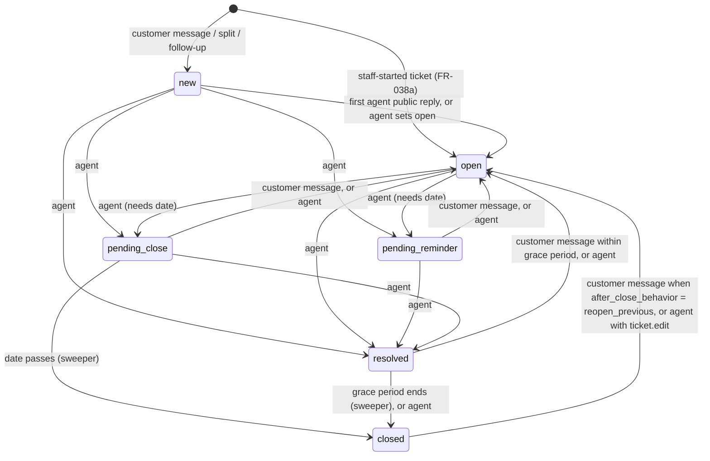

# Data Model: Multi-Tenant Customer Support Platform

**Feature**: [spec.md](spec.md) | **Plan**: [plan.md](plan.md) | **Decisions**: [research.md](research.md)

## Conventions

- Primary keys are UUIDv7 (`id uuid`), which sort by creation time.
- **Every tenant-owned table** has `tenant_id uuid NOT NULL REFERENCES tenants(id)`, a composite
  index that **leads with `tenant_id`**, and a forced row-level security policy
  `tenant_id = current_setting('app.tenant_id')::uuid` (research D3).
- Foreign keys between tenant-owned tables are composite (`(tenant_id, x_id)`) so a row can never
  point at another tenant's row.
- Timestamps are `timestamptz`, stored in UTC. `created_at` and `updated_at` exist on every table
  unless noted.
- Uniqueness that is "per tenant" is enforced with `UNIQUE (tenant_id, ...)`. Email uniqueness is
  case-insensitive (`citext`).
- Enums are PostgreSQL `text` with `CHECK` constraints (easier to extend, FR-043).
- Owning module is shown for each table. Modules read and write only their own tables. Other
  modules go through the owner's service or events.

**Global tables** (no `tenant_id`, no RLS): `tenants`, `platform_operators`,
`permission_definitions`, `outbox_events` (has `tenant_id` but is read by the relay across
tenants under the platform role).

## Entity relationship overview

```mermaid
erDiagram
    tenants ||--|| tenant_settings : has
    tenants ||--o{ users : has
    tenants ||--o{ support_access_grants : grants
    users ||--o| customer_profiles : "if customer"
    users ||--o{ sessions : has
    users ||--o{ user_roles : holds
    roles ||--o{ user_roles : ""
    roles ||--o{ role_permissions : grants
    permission_definitions ||--o{ role_permissions : ""
    roles ||--o{ role_group_access : "per group"
    groups ||--o{ role_group_access : ""
    tickets }o--|| users : "customer"
    tickets }o--o| users : "owner"
    tickets }o--o| groups : "group (null = Ungrouped)"
    tickets ||--o{ ticket_messages : has
    ticket_messages ||--o{ attachments : has
    tickets ||--o{ ticket_history : records
    tickets ||--o{ ticket_links : "from/to"
    tickets ||--o{ ticket_tags : ""
    tags ||--o{ ticket_tags : ""
    tags ||--o{ customer_tags : ""
    tickets ||--o| ticket_sla : tracks
    sla_policies ||--o{ ticket_sla : applies
    tickets ||--o| csat_ratings : rated
    views }o--|| users : "owner (personal)"
    notifications }o--|| users : recipient
    webhooks ||--o{ webhook_deliveries : logs
```



---

## Tenancy (module: Tenancy)

### tenants (global)
| Field | Type | Rules |
|-------|------|-------|
| id | uuid | PK |
| slug | text | unique globally, 3–40 chars, `^[a-z0-9](-?[a-z0-9])*$`, not in reserved list (research D2) |
| name | text | 1–120 chars |
| status | text | `active` \| `suspended` |
| access_version | bigint | incremented on any access change (research D6) |
| suspended_at | timestamptz | null unless suspended |

### tenant_settings (1:1 with tenant)
| Field | Type | Default / rules |
|-------|------|-----------------|
| tenant_id | uuid | PK |
| logo_attachment_id | uuid | nullable |
| brand_colors | jsonb | `{primary, accent}`; primary must pass the WCAG AA contrast check on save (FR-071a) |
| welcome_message | text | ≤ 500 chars |
| timezone | text | IANA zone, default `UTC` |
| self_registration | boolean | `true` |
| grace_period_hours | int | `72` (3 days), 1–720 |
| after_close_behavior | text | `new_follow_up` (default) \| `reopen_previous` |
| offline_customer_notification | text | `email` (default) \| `off` |
| out_of_hours_message | text | nullable |
| retention_period | text | `forever` (default) \| ISO duration `P1Y`..`P7Y` (FR-005a) |
| audit_retention | text | `forever` (default) \| ISO duration ≥ `P1Y` |
| notification_defaults | jsonb | per-event × channel defaults (FR-080) |

### tenant_counters
`(tenant_id, name)` PK, `value bigint`. `name = 'ticket_number'` starts at 1000 (research D4).

### platform_operators (global)
`id`, `email citext unique`, `name`, `password_hash`, `status`, `last_sign_in_at`.

### support_access_grants
| Field | Type | Rules |
|-------|------|-------|
| id, tenant_id | uuid | |
| granted_by | uuid | admin user id |
| reason | text | optional, ≤ 500 |
| starts_at, expires_at | timestamptz | `expires_at - starts_at ≤ 7 days` (FR-001a) |
| revoked_at, revoked_by | | nullable |

Active grant = `revoked_at IS NULL AND now() BETWEEN starts_at AND expires_at`. Operator reads
under a grant run read-only (research D3), and each read is audited.

---

## Identity (module: Identity)

### users
| Field | Type | Rules |
|-------|------|-------|
| id, tenant_id | uuid | |
| email | citext | `UNIQUE (tenant_id, email)` |
| name | text | 1–120 |
| avatar_attachment_id | uuid | nullable |
| password_hash | text | nullable (customers may have none, FR-012) |
| status | text | `invited` \| `active` \| `deactivated` |
| kind | text | `staff` \| `customer`, derived from roles on change and kept for fast filtering |
| availability | text | staff only: `online` \| `away` \| `offline` (FR-015) |
| time_display | jsonb | per-user time display preference |
| failed_sign_ins | int | reset on success |
| locked_until | timestamptz | lockout (research D5) |
| last_sign_in_at | timestamptz | FR-014 |
| erased_at | timestamptz | set by data erasure; personal fields replaced |

Indexes: `(tenant_id, email)`, `(tenant_id, kind, status)`, trigram on `name` and `email` (search).

### customer_profiles (module: Customers)
`user_id` PK/FK, `tenant_id`, `phone`, `company`, `notes` (staff-only), `last_message_at`.

### user_invitations
`id`, `tenant_id`, `email`, `role_ids uuid[]`, `invited_by`, `token_hash`, `expires_at` (7 days),
`accepted_at`. Unique pending invitation per `(tenant_id, email)`.

### sign_in_links
`id`, `tenant_id`, `user_id`, `token_hash`, `expires_at` (15 min), `used_at`, `superseded_at`.
Requesting a new link sets `superseded_at` on older unused links (FR-012).

### password_resets
`id`, `tenant_id`, `user_id`, `token_hash`, `expires_at` (30 min), `used_at`.

### sessions
`id`, `tenant_id`, `user_id`, `token_hash` (unique), `kind` (`staff` \| `customer` \| `operator`),
`trusted_device boolean`, `last_seen_at`, `expires_at`, `ip`, `user_agent`.
Idle expiry: staff 12 h, customers 30 days (trusted). Operator sessions live on the console host
and have `tenant_id = NULL` (stored in a separate `operator_sessions` table to keep RLS simple).

---

## Authorization (module: Authorization)

### permission_definitions (global)
`key` PK (e.g. `ticket.merge`), `resource`, `action`, `module`, `description`, `introduced_at`.
Synced from code on startup (research D6).

### roles
`id`, `tenant_id`, `name` (`UNIQUE (tenant_id, lower(name))`), `description`,
`system_key` (`customer` \| `agent` \| `manager` \| `admin` \| null). System roles can't be
deleted or renamed. Admin's grants can't be reduced.

### role_permissions
`(tenant_id, role_id, permission_key)` PK, `scope text DEFAULT 'tenant'` (future:
`own`, `assigned`, FR-027).

### user_roles
`(tenant_id, user_id, role_id)` PK. A role with any rows here can't be deleted (FR-020).

### groups (module: Groups)
`id`, `tenant_id`, `name` (`UNIQUE (tenant_id, lower(name))`), `description`, `status`
(`active` \| `inactive`). A group can't be deleted while any ticket has `group_id = id` (FR-030).

### role_group_access
| Field | Type | Rules |
|-------|------|-------|
| tenant_id, role_id | uuid | |
| group_id | uuid | **null means the built-in Ungrouped entry** |
| can_view, can_create, can_edit, can_delete | boolean | |
| scope | text | `group` (future: `assigned`, `own`) |

Unique `(tenant_id, role_id, COALESCE(group_id, '00000000-0000-0000-0000-000000000000'))`.
There is no group-membership table: owner eligibility for group G is "active staff user with a
role granting `can_edit` on G".

**Effective access** for a user = union over their roles, per group, of each flag (FR-021).

### Default seed per tenant (FR-006, FR-024)

| Role | Permissions | Group access |
|------|-------------|--------------|
| Admin | every registered permission (always) | all groups + Ungrouped: view, create, edit, delete (enforced on group creation; can't be removed) |
| Manager | ticket.view, ticket.edit, ticket.merge, ticket.split, ticket.bulk_update, view.create/view/edit, tag.view, macro.view, dashboard.view, user.view | Ungrouped: view, edit |
| Agent | ticket.view, ticket.edit, view.create (personal), view.view, tag.view, macro.view, dashboard.view | none |
| Customer | none (customer API is authorized separately, by ownership) | none |

### Initial permission registry (FR-018)

| Resource | Actions |
|----------|---------|
| user | create, view, edit, delete, erase |
| role | create, view, edit, delete |
| group | create, view, edit, delete |
| ticket | create, view, edit, delete, merge, split, bulk_update, move_message |
| view | create, view, edit, delete, share |
| tag | create, view, edit, delete |
| macro | create, view, edit, delete |
| sla_policy | create, view, edit, delete |
| routing_rule | create, view, edit, delete |
| automation_rule | create, view, edit, delete |
| webhook | create, view, edit, delete |
| tenant_settings | view, edit |
| support_access | view, create, delete |
| audit_log | view |
| dashboard | view |

`ticket.*` permissions are necessary but not sufficient: the action must also be allowed by
role–group access for the ticket's group (FR-023).

---

## Tickets (module: Tickets)

### tickets
| Field | Type | Rules |
|-------|------|-------|
| id, tenant_id | uuid | |
| number | bigint | `UNIQUE (tenant_id, number)`, from `tenant_counters` |
| title | text | 1–200 |
| customer_id | uuid | FK users (customer) |
| group_id | uuid | nullable = Ungrouped; must be an active group when set or changed |
| owner_id | uuid | nullable; must have edit on `group_id` (FR-040) |
| priority | text | `low` \| `normal` \| `high` \| `urgent`, default `normal` |
| state | text | see state machine |
| pending_until | timestamptz | required when state is `pending_reminder` or `pending_close` |
| auto_close_at | timestamptz | set when `resolved` (= resolved_at + grace period) |
| waiting_on | text | `support` \| `customer` (derived on each message) |
| origin | text | `customer_message` \| `staff_started` \| `split` \| `follow_up` |
| merged_into_id | uuid | set when merged |
| resolved_at, closed_at | timestamptz | |
| last_customer_message_at, last_agent_reply_at | timestamptz | |
| first_agent_reply_at | timestamptz | used for SLA and dashboard metrics |
| deleted_at | — | not used: ticket deletion is a hard delete (spec Assumptions) |

Indexes (all lead with `tenant_id`):
- `(tenant_id, state, group_id)`, `(tenant_id, group_id, owner_id) WHERE state <> 'closed'`
- `(tenant_id, owner_id, state)`, `(tenant_id, customer_id, updated_at DESC)`
- `(tenant_id, updated_at DESC)`, `(tenant_id, created_at DESC)`
- `(tenant_id, last_customer_message_at)`, `(tenant_id, last_agent_reply_at)`
- `(pending_until) WHERE state IN ('pending_reminder','pending_close')`,
  `(auto_close_at) WHERE state = 'resolved'` (sweeper, research D11)
- GIN `tsvector` on title (research D14)

### ticket_messages (module: Messaging)
| Field | Type | Rules |
|-------|------|-------|
| id, tenant_id, ticket_id | uuid | |
| author_id | uuid | user id; null for system/automation messages |
| author_kind | text | `customer` \| `staff` \| `system` \| `automation` |
| visibility | text | `public` \| `internal` |
| body | text | 1–10,000 chars; sanitized Markdown subset, rendered safely |
| client_message_id | text | idempotency key, `UNIQUE (tenant_id, author_id, client_message_id)` |
| mentions | uuid[] | staff ids (internal notes) |
| moved_from_ticket_id | uuid | set when an agent moves the message (FR-042) |
| delivered_at, read_at | timestamptz | read receipts for the chat (FR-053) |

Messages are immutable: no update or delete except by ticket deletion, retention purge, or erasure.
Indexes: `(tenant_id, ticket_id, created_at)`, GIN `tsvector` on body.

### attachments (module: Attachments)
`id`, `tenant_id`, `message_id` (null until the message is sent; unattached uploads expire after
24 h), `uploaded_by`, `file_name`, `content_type`, `size_bytes` (≤ 25 MB), `storage_key` (never
exposed), `scan_status` (`pending` \| `clean` \| `blocked`), `scanned_at`.

### ticket_links
`id`, `tenant_id`, `from_ticket_id`, `to_ticket_id`, `kind` (`follow_up_of` \| `related` \|
`duplicate_of` \| `merged_into` \| `split_from`). Unique `(tenant_id, from, to, kind)`.
When a linked ticket is purged by retention, the surviving side keeps a tombstone link
(`to_ticket_id = NULL`, `removed_reason = 'retention'`).

### ticket_history
`id`, `tenant_id`, `ticket_id`, `actor_id`, `actor_kind` (`user` \| `system` \| `automation`
\| `routing`), `field`, `old_value jsonb`, `new_value jsonb`, `event_id`. Append-only.

### tags, ticket_tags, customer_tags (module: Tags)
`tags(id, tenant_id, name UNIQUE (tenant_id, lower(name)))`;
`ticket_tags(tenant_id, ticket_id, tag_id)`; `customer_tags(tenant_id, user_id, tag_id)`.

### csat_ratings
`id`, `tenant_id`, `ticket_id` (unique), `customer_id`, `score` (1–5), `comment` (≤ 1000).

---

## Views, notifications (modules: Views, Notifications)

### views
| Field | Type | Rules |
|-------|------|-------|
| id, tenant_id | uuid | |
| name, description | text | |
| system_key | text | default views (FR-073); editable, hideable, reorderable |
| owner_id | uuid | set for personal views |
| visibility | text | `personal` \| `all_staff` \| `roles` \| `groups` |
| shared_role_ids, shared_group_ids | uuid[] | |
| conditions | jsonb | expression tree (below) |
| sort | jsonb | `[{field, direction}]` |
| columns | text[] | whitelisted column keys |
| position | int | order |
| hidden | boolean | |

**Condition expression** (validated by JSON Schema, compiled per research D13):

```json
{ "op": "and", "items": [
  { "field": "state", "operator": "is", "value": ["new", "open"] },
  { "op": "or", "items": [
    { "field": "owner", "operator": "is", "value": "me" },
    { "field": "owner", "operator": "is", "value": "unassigned" } ] },
  { "field": "last_customer_message_at", "operator": "within_last", "value": "PT4H" } ] }
```

Fields: `state`, `priority`, `group` (incl. `ungrouped`), `owner` (incl. `me`, `unassigned`),
`customer`, `tags`, `waiting_on`, `created_at`, `updated_at`, `last_customer_message_at`,
`sla_status`. Operators: `is`, `is_not`, `contains`, `before`, `after`, `within_last`. Maximum
nesting depth 3, maximum 20 conditions.

**Default view conditions** (FR-073):

| View | Conditions |
|------|------------|
| Needs Triage | group is ungrouped AND state is not closed |
| Unassigned & Open | group is not ungrouped AND owner is unassigned AND state is not closed |
| My Tickets | owner is me AND state is not closed |
| My Pending Reminders Reached | owner is me AND state is pending_reminder AND pending_until before now |
| Waiting on Support | waiting_on is support AND state in (new, open) |
| All Open | state in (new, open, pending_reminder, pending_close) |
| New | state is new |
| Pending | state in (pending_reminder, pending_close) |
| High & Urgent | priority in (high, urgent) AND state is not closed |
| Escalated | sla_status in (warning, breached) AND state is not closed |
| Resolved | state is resolved |
| Closed | state is closed |

Needs Triage is visible only to viewers with Ungrouped view access. Every view is additionally
limited by the viewer's access filter (FR-077).

### notifications
`id`, `tenant_id`, `recipient_id`, `event_type`, `ticket_id`, `group_key`, `count`, `title`,
`summary` (never includes internal-note text for customers), `read_at`, `event_id`.
Index `(tenant_id, recipient_id, read_at, created_at DESC)`.

### notification_deliveries
`(tenant_id, recipient_id, event_id, channel)` unique, `status`, `sent_at` (research D20).

### notification_preferences
`(tenant_id, user_id)` PK, `enabled boolean`, `events jsonb` (`{event: {in_app, push, email}}`),
`push_subscriptions jsonb`.

---

## Routing & Automation, SLA, Macros

### routing_rules
`id`, `tenant_id`, `name`, `position` (order), `enabled`, `conditions jsonb` (first-message
phrases with `contains_any`/`contains_all`, customer tags, email domain), `actions jsonb`
(`{group_id, priority?, tag_ids?}`).

### automation_rules (P3)
`id`, `tenant_id`, `name`, `enabled`, `trigger` (`ticket.created` \| `ticket.updated` \|
`message.created` \| `time.elapsed`), `conditions jsonb`, `actions jsonb`, `position`.
Loop guard: events caused by a rule carry `cause.rule_id`, and a rule never runs on its own
events. The maximum chain depth is 3 (FR-089).

### macros
`id`, `tenant_id`, `name`, `body` (reply template), `actions jsonb` (state, priority, tags,
owner), `visibility` (`all_staff` \| `roles` \| `groups`).

### business_hours
`id`, `tenant_id`, `name`, `timezone`, `intervals jsonb` (weekday → `[{from, to}]`),
`holidays date[]`.

### sla_policies
`id`, `tenant_id`, `name`, `position`, `conditions jsonb` (priority, group), `business_hours_id`,
`first_response_minutes`, `next_response_minutes`, `resolution_minutes`, `warning_percent`
(default 80).

### ticket_sla
`ticket_id` PK, `tenant_id`, `policy_id`, `first_response_due_at`, `next_response_due_at`,
`resolution_due_at`, the matching `*_warn_at`, `status` (`ok` \| `warning` \| `breached`),
`paused_since`. Index `(tenant_id, status)`, `(first_response_warn_at)` and so on for the sweeper.

### sla_events
Unique `(tenant_id, ticket_id, target, kind)` so each warning or breach fires once.

---

## Audit, Integrations, Infrastructure

### audit_logs (module: Audit)
`id`, `tenant_id`, `occurred_at`, `actor_id`, `actor_kind` (`user` \| `operator` \| `system` \|
`automation`), `action` (e.g. `ticket.assigned`, `auth.sign_in_failed`, `support_access.read`),
`resource_type`, `resource_id`, `details jsonb` (never message bodies or secrets), `ip`,
`request_id`. **Append-only**: the app role has `INSERT` and `SELECT` only; `UPDATE` and `DELETE`
are revoked. The retention job deletes through a dedicated role. Index
`(tenant_id, occurred_at DESC)`, `(tenant_id, actor_id)`, `(tenant_id, resource_type, resource_id)`.

### webhooks
`id`, `tenant_id`, `url` (https), `secret_encrypted`, `events text[]`, `enabled`,
`created_by`.

### webhook_deliveries
`id`, `tenant_id`, `webhook_id`, `event_id`, `attempt`, `status` (`pending` \| `succeeded` \|
`failed` \| `gave_up`), `response_code`, `duration_ms`, `error`, `next_attempt_at`.
Retention 30 days.

### outbox_events
`id` (UUIDv7), `tenant_id`, `type`, `actor jsonb`, `payload jsonb`, `customer_payload jsonb`
(projection for customer streams, research D9), `streams text[]`, `cause jsonb`,
`created_at`, `seq bigint` (assigned by relay), `published_at`. Index
`(published_at) WHERE published_at IS NULL`, `(seq)`, GIN on `streams`. Pruned after 7 days.

### processed_events
`(consumer, event_id)` PK, `processed_at`. Pruned after 7 days.

---

## Ticket state machine



Rules:
- A customer message on `new` keeps it `new` (no agent has replied yet). On any `pending_*`
  state it moves to `open` (FR-033).
- Reaching `pending_reminder`'s date does not change state. It emits
  `ticket.reminder_reached` and the ticket appears in "My Pending Reminders Reached".
- Entering `resolved` sets `resolved_at` and `auto_close_at`. Leaving it clears both.
- Entering `closed` sets `closed_at`. Reopening clears `resolved_at` and `closed_at` and keeps
  group and owner.
- Merge: the source ticket becomes `closed` with `merged_into_id` set. Its messages are shown
  within the target's timeline (not copied), so the customer thread never shows duplicates.
- Every transition writes `ticket_history` and an outbox event (`ticket.state_changed`, plus
  `ticket.closed` when relevant).

## Conversation routing

Runs inside `CustomerMessageRouter.accept` under the customer's advisory lock (research D10).

```text
1. If (tenant, customer, client_message_id) already exists → return that message (idempotent).
2. active := customer's tickets in (new, open, pending_reminder, pending_close),
             not merged, ordered by updated_at DESC.
   If active is not empty → target := active[0]; append; pending_* → open.
3. Else last := customer's most recent ticket (by created_at).
   If last.state = resolved AND now < last.auto_close_at
        → target := last; append; state := open (group and owner kept).
4. Else if last exists (closed, or resolved past grace but not yet swept → close it first):
     if tenant.after_close_behavior = reopen_previous → reopen last; append.
     else → create new ticket (state new, origin follow_up), link follow_up_of → last; append;
            run routing rules.
5. Else (no tickets at all, or last was purged by retention)
        → create new ticket (state new, origin customer_message), no link; append;
          run routing rules.
6. Update last_customer_message_at, waiting_on = support; emit message.created
   (+ ticket.created / ticket.reopened), commit.
```

**Routing rules** (P2) run at ticket creation through the `TicketRouter` interface. The rule
router evaluates `routing_rules` by `position`, skips rules that target inactive groups, and
applies the first match. With no match, `group_id` stays null (Needs Triage). A future classifier
implements the same interface.

## Validation rules summary (from requirements)

| Rule | Enforced by |
|------|-------------|
| Owner must have edit on ticket's group (FR-040) | Tickets service via policy `eligibleOwners(group)` |
| Moving groups needs edit on source + create on destination; Ungrouped edit may move to any active group (FR-041) | Tickets service + policy |
| Inactive group receives no new or moved tickets (FR-028) | Tickets service, routing router |
| Owner loses edit → unassign (FR-026) | Access-change consumer, in the same transaction as the access change |
| User deactivated → sessions revoked, tickets unassigned (FR-008) | Identity service + Tickets consumer |
| System roles undeletable; Admin access irreducible (FR-019) | Authorization service, DB check on `system_key` |
| Role in use can't be deleted (FR-020) | FK `user_roles.role_id` ON DELETE RESTRICT |
| Group with tickets can't be deleted (FR-030) | FK `tickets.group_id` ON DELETE RESTRICT |
| Message immutable (FR-036) | No update endpoint; DB trigger rejects UPDATE of `body`/`visibility` |
| Attachment ≤ 25 MB, allowed types (FR-045) | Attachments service (magic bytes) |
| Customer 20 messages/min (FR-057) | Rate limiter |
